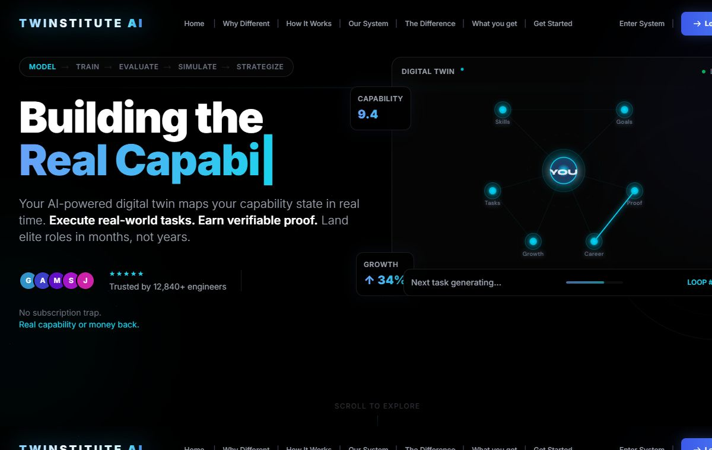

# Twinstitute AI · Capability Atlas

### Model the learner. Exercise the skill. Preserve the proof.

[**Explore the live platform →**](https://twinstitute-ai.vercel.app)

A capability-engineering prototype that frames learning as a continuous loop of modelling, real-world execution, evaluation, simulation, and next-step strategy.

---

## The central hypothesis

Conventional learning products often measure attendance, content completion, or test performance. Twinstitute explores a different model: represent a learner’s evolving capability, assign work at the edge of that capability, evaluate the evidence, and use the result to choose what happens next.

~~~mermaid
flowchart LR
    M[Model] --> T[Train]
    T --> E[Evaluate]
    E --> S[Simulate]
    S --> R[Strategize]
    R --> M
~~~

This is a product direction embodied in code—not proof that the system already improves employment, learning velocity, or hiring outcomes. Those claims require controlled measurement and real longitudinal data.

## Three institutional layers

| Layer | Purpose |
|---|---|
| **Digital twin** | hold the current picture of skills, strengths, gaps, learning history, and goals |
| **Execution labs** | provide practical tasks instead of passive content consumption |
| **Proof system** | turn evaluated work into inspectable capability evidence |

The public experience explains the model; authenticated application routes carry signup, login, dashboards, and the evolving learner workflow.

## Intelligence map

~~~mermaid
flowchart TB
    PROFILE[Learner profile] --> TWIN[Capability twin]
    HISTORY[Learning and task history] --> TWIN
    GOAL[Target role or outcome] --> TWIN

    TWIN --> TASK[Task generation]
    TASK --> WORK[Real-world execution]
    WORK --> EVAL[Multi-dimensional evaluation]
    EVAL --> PROOF[Proof artifact]
    EVAL --> SCORE[Capability update]
    SCORE --> TWIN
    PROOF --> ROADMAP[Career and learning roadmap]
    TWIN --> ROADMAP
~~~

### Product pillars

- capability mapping;
- adaptive task generation;
- evaluation across more than completion status;
- durable proof artifacts;
- next-action and roadmap guidance.

Each pillar should expose its evidence and uncertainty. A generated score without an explainable rubric is not proof.

## Application shape

~~~text
Twinstitute-AI/
├── app/                  Next.js routes, public experience, auth, dashboards
├── components/           Product sections and reusable interface elements
├── hooks/                Shared client behaviours
├── lib/                  Services, helpers, auth, and data access
├── prisma/               Database schema and migrations
├── public/               Static media and genuine product capture
├── types/                Shared TypeScript contracts
├── next.config.js        Next.js configuration
└── vercel.json           Deployment configuration
~~~

The repository is a full-stack Next.js application with Prisma-backed data modelling. The checked-in environment guides remain the source of truth for provider, authentication, and database configuration.

## Trust boundary

~~~mermaid
sequenceDiagram
    actor L as Learner
    participant UI as Next.js application
    participant AUTH as Auth/session layer
    participant API as Server actions/routes
    participant AI as AI services
    participant DB as Prisma database

    L->>UI: Sign in and submit profile or work
    UI->>AUTH: Validate identity and session
    AUTH-->>API: Authorized learner context
    API->>DB: Read scoped capability state
    API->>AI: Request task or evaluation
    AI-->>API: Generated proposal
    API->>DB: Store reviewed result and evidence
    API-->>UI: Updated task, score, or roadmap
    UI-->>L: Show result with context
~~~

Before production use, verify tenant isolation, authorization on every server path, provider-data handling, prompt injection resistance, file validation, scoring calibration, audit history, and deletion/export workflows.

## Local orientation

### Requirements

- Node.js 18+
- npm
- a configured database supported by the checked-in Prisma schema
- the environment values described in ENV_INSTRUCTIONS.md

~~~bash
git clone https://github.com/QizarBilal/Twinstitute-AI.git
cd Twinstitute-AI
npm install
cp .env.production.example .env.local
npx prisma generate
npm run dev
~~~

Open **http://localhost:3000**.

Apply database changes only after reviewing the target environment and Prisma migration state.

## Read the platform honestly

The deployed interface currently contains promotional figures, testimonials, guarantees, and outcome language. Treat those as product copy—not verified repository benchmarks—unless supporting methodology and source data are published.

For trustworthy capability evidence:

1. publish the scoring rubric;
2. record evaluator and model versions;
3. retain the source work behind each proof artifact;
4. show confidence and uncertainty;
5. allow learner corrections and appeals;
6. separate predicted readiness from observed performance;
7. evaluate fairness across relevant groups;
8. never make automated employment decisions from a single score.

## Delivery checklist

~~~bash
npm run build
npx prisma validate
~~~

Also review environment separation, preview database safety, secret exposure, auth callback URLs, dependency advisories, accessibility, and mobile layout before release.

## Documentation index

- ENV_INSTRUCTIONS.md — environment configuration
- RUNNING_INSTRUCTIONS.md — application startup
- VERCEL_DEPLOYMENT_COMPLETE.md — deployment notes
- orientation-agent.agent.md — product orientation material
- roadmap.agent.md — roadmap context

## Maintainer and license

Built and maintained by **Mohammed Qizar Bilal**. Source code is released under the [MIT License](LICENSE).

[Live platform](https://twinstitute-ai.vercel.app) · [GitHub](https://github.com/QizarBilal) · [Portfolio](https://qizar-bilal.vercel.app)

---

Capability deserves evidence, context, and an honest confidence interval.

